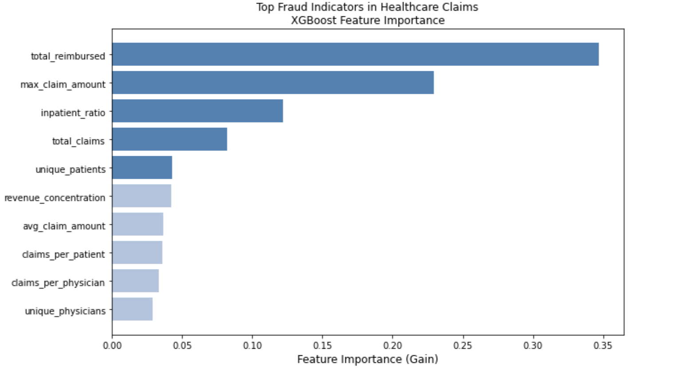
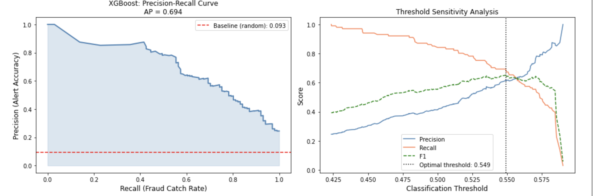

# healthcare-fraud-detector
## Medicare Claims Anomaly Detection using XGBoost

---

## Overview

Healthcare fraud costs the United States approximately $100 billion annually and traditional rule-based detection systems miss sophisticated 
fraud patterns that emerge only when analyzing provider billing behavior in aggregate across thousands of claims. This project builds an end-to-end ML pipeline to identify fraudulent Medicare providers from behavioral patterns in CMS claims data without relying on any individual claim-level rules.

---

## Key Finding

XGBoost model achieved AUC-ROC of 0.950 and Average Precision of 0.694 on held-out test data. The most predictive fraud 
indicator was total reimbursed, followed by maximum claim amount which is consistent with known Medicare fraud schemes involving systematic billing inflation where fraudulent providers submit claims at inflated reimbursement rates across large patient volumes, and highlighting schemes where individual procedures are billed at higher-complexity codes than the services actually rendered. Both features capture the financial signature of providers extracting disproportionate Medicare reimbursement relative to legitimate peers in the same specialty.].

At the optimal operating threshold of 0.549, the model achieves 62% precision and 69% recall meaning 62% of flagged providers are genuinely fraudulent, and the model catches 69% of all fraud in the dataset.

---

## Clinical and Business Context

Fraud detection in healthcare claims is fundamentally an imbalanced classification problem and in this dataset 9.35% of 
providers committed fraud, creating significant class imbalance that naive accuracy metrics cannot capture. This mirrors the challenge of rare adverse event prediction in clinical ML, where the minority class (fraud, mortality, readmission) is precisely what the system must 
detect reliably.

The precision-recall tradeoff here has a direct operational interpretation: precision determines how efficiently auditors spend 
their investigation time, while recall determines how much fraud dollar value the system recovers. This tradeoff framework is identical to clinical screening systems where false positive rates drive patient anxiety and cost, while false negative rates drive missed diagnoses.

---

## Methodology

### 1. Data Sources
Four relational tables from the Kaggle Healthcare Provider Fraud Detection dataset:
- Provider fraud labels (train) — binary fraud indicator per provider
- Beneficiary data — patient demographics and chronic conditions
- Inpatient claims — hospital admission billing records
- Outpatient claims — outpatient visit billing records

### 2. Feature Engineering
Fraud signal extraction at the provider level through aggregation across all associated claims:

| Feature | Description | Fraud Signal |
|---|---|---|
| total_claims | Total claims submitted | Volume anomalies |
| avg_claim_amount | Mean reimbursement per claim | Billing inflation |
| max_claim_amount | Highest single claim | Outlier billing |
| unique_patients | Distinct patients served | Patient pool patterns |
| unique_physicians | Distinct physicians billing | Physician concentration |
| claims_per_physician | Claims per unique physician | Fraud ring detection |
| revenue_concentration | Max/avg claim ratio | Outlier billing patterns |
| inpatient_ratio | Fraction of inpatient claims | Modality manipulation |

Key insight: individual claims rarely reveal fraud where the pattern across thousands of claims per provider is what separates fraudulent 
from legitimate billing behavior.

### 3. Class Imbalance Handling
Applied SMOTE (Synthetic Minority Oversampling Technique) to training data only, generating synthetic fraud examples to balance the 9.35% fraud rate in training without contaminating test set evaluation metrics.

### 4. Models
- Logistic Regression baseline — establishes minimum performance bar
- XGBoost — production model with scale_pos_weight calibrated to class imbalance ratio, early stopping on Average Precision

### 5. Evaluation
Primary metric: Average Precision (AUC-PR) which is more meaningful than AUC-ROC for imbalanced datasets because it weights performance at high-recall operating points where fraud systems must operate.

Secondary metric: AUC-ROC for comparison with published benchmarks.

Operational metric: Precision and Recall at optimal F1 threshold, the actual numbers that determine real-world system performance.

---

## Results

| Model | AUC-ROC | Average Precision |
|---|---|---|
| Logistic Regression (baseline) | 0.953 | 0.739 |
| XGBoost | 0.950 | 0.694 |

### Top Fraud Indicators



### Precision-Recall Analysis



---

## Connection to Clinical ML

This project directly extends my clinical ML research at UCLA Health Radiation Oncology and my independent MIMIC-III mortality prediction work. The core technical challenge, imbalanced classification where the minority class carries outsized clinical or financial consequence, is identical across fraud detection, ICU mortality prediction, and adverse treatment outcome modeling. The same SMOTE oversampling, XGBoost modeling, and precision-recall threshold optimization framework applies across all three domains.

---

## Tech Stack

Python · XGBoost · scikit-learn · imbalanced-learn ·
Pandas · NumPy · Matplotlib · Seaborn · Jupyter


## How To Run

```bash
pip install xgboost imbalanced-learn scikit-learn pandas 
            numpy matplotlib seaborn jupyter
```

Download the dataset from:
kaggle.com/datasets/rohitrox/healthcare-provider-fraud-detection-analysis
